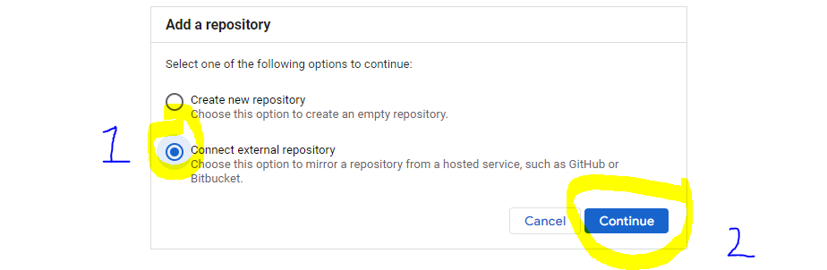

# Cement-Strength-prediction

****Problem Statement****

To build a regression model to predict the concrete compressive strength based on the different features in the training data. 

****Architecture****

  
****Data Description****
Given is the variable name, variable type, the measurement unit and a brief description. 
The concrete compressive strength is the regression problem. The order of this listing 
corresponds to the order of numerals along the rows of the database. 

Apart from training files, we also require a "schema" file from the client, which contains all the relevant information about the training files such as:
Name of the files, Length of Date value in FileName, Length of Time value in FileName, Number of Columns, Name of the Columns, and their datatype.
 
**Data Validation ******

In this step, we perform different sets of validation on the given set of training files.  
1.	 Name Validation- We validate the name of the files based on the given name in the schema file. We have created a regex pattern as per the name given in the schema file to use for validation. After validating the pattern in the name, we check for the length of date in the file name as well as the length of time in the file name. If all the values are as per requirement, we move such files to "Good_Data_Folder" else we move such files to "Bad_Data_Folder."

2.	 Number of Columns - We validate the number of columns present in the files, and if it doesn't match with the value given in the schema file, then the file is moved to "Bad_Data_Folder."

3.	 Name of Columns - The name of the columns is validated and should be the same as given in the schema file. If not, then the file is moved to "Bad_Data_Folder".

4.	 The datatype of columns - The datatype of columns is given in the schema file. This is validated when we insert the files into Database. If the datatype is wrong, then the file is moved to "Bad_Data_Folder".

5.	Null values in columns - If any of the columns in a file have all the values as NULL or missing, we discard such a file and move it to "Bad_Data_Folder".

**Data Insertion in Database******
 
1) Database Creation and connection - Create a database with the given name passed. If the database is already created, open the connection to the database. 
2) Table creation in the database - Table with name - "Good_Data", is created in the database for inserting the files in the "Good_Data_Folder" based on given column names and datatype in the schema file. If the table is already present, then the new table is not created and new files are inserted in the already present table as we want training to be done on new as well as old training files.     
3) Insertion of files in the table - All the files in the "Good_Data_Folder" are inserted in the above-created table. If any file has invalid data type in any of the columns, the file is not loaded in the table and is moved to "Bad_Data_Folder".
 
**Model Training****** 

1) Data Export from Db - The data in a stored database is exported as a CSV file to be used for model training.
2) Data Preprocessing  
   a) Check for null values in the columns. If present, impute the null values using the KNN imputer
   b) transform the features using log transformation
   c) Scale the training and test data separately 
3) Clustering - KMeans algorithm is used to create clusters in the preprocessed data. The optimum number of clusters is selected by plotting the elbow plot, and for the dynamic selection of the number of clusters, we are using "KneeLocator" function. The idea behind clustering is to implement different algorithms
   To train data in different clusters. The Kmeans model is trained over preprocessed data and the model is saved for further use in prediction.
4) Model Selection - After clusters are created, we find the best model for each cluster. We are using two algorithms, "Random forest Regressor" and “Linear Regression”. For each cluster, both the algorithms are passed with the best parameters derived from GridSearch. We calculate the Rsquared scores for both models and select the model with the best score. Similarly, the model is selected for each cluster. All the models for every cluster are saved for use in prediction. 
 
**Prediction Data Description******
 
Client will send the data in multiple set of files in batches at a given location. Data will contain climate indicators in 8 columns.
Apart from prediction files, we also require a "schema" file from client which contains all the relevant information about the training files such as:
Name of the files, Length of Date value in FileName, Length of Time value in FileName, Number of Columns, Name of the Columns and their datatype.

**Data Validation ****** 

In this step, we perform different sets of validation on the given set of training files.  
1) Name Validation- We validate the name of the files on the basis of given Name in the schema file. We have created a regex pattern as per the name given in schema file, to use for validation. After validating the pattern in the name, we check for length of date in the file name as well as length of time in the file name. If all the values are as per requirement, we move such files to "Good_Data_Folder" else we move such files to "Bad_Data_Folder". 
2) Number of Columns - We validate the number of columns present in the files, if it doesn't match with the value given in the schema file then the file is moved to "Bad_Data_Folder". 
3) Name of Columns - The name of the columns is validated and should be same as given in the schema file. If not, then the file is moved to "Bad_Data_Folder". 
4) Datatype of columns - The datatype of columns is given in the schema file. This is validated when we insert the files into Database. If dataype is wrong then the file is moved to "Bad_Data_Folder". 
5) Null values in columns - If any of the columns in a file has all the values as NULL or missing, we discard such file and move it to "Bad_Data_Folder".  

**Data Insertion in Database ******

1) Database Creation and connection - Create database with the given name passed. If the database is already created, open the connection to the database. 
2) Table creation in the database - Table with name - "Good_Data", is created in the database for inserting the files in the "Good_Data_Folder" on the basis of given column names and datatype in the schema file. If table is already present then new table is not created, and new files are inserted the already present table as we want training to be done on new as well old training files.     
3) Insertion of files in the table - All the files in the "Good_Data_Folder" are inserted in the above-created table. If any file has invalid data type in any of the columns, the file is not loaded in the table and is moved to "Bad_Data_Folder".

**Prediction****** 
 
1) Data Export from Db - The data in the stored database is exported as a CSV file to be used for prediction.
2) Data Preprocessing   
   a) Check for null values in the columns. If present, impute the null values using the KNN imputer
   b) transform the features using log transformation
   c) Scale the training and test data separately 
3) Clustering - KMeans model created during training is loaded, and clusters for the preprocessed prediction data is predicted.
4) Prediction - Based on the cluster number, the respective model is loaded and is used to predict the data for that cluster.
5) Once the prediction is made for all the clusters, the predictions along with the original names before label encoder are saved in a CSV file at a given location and the location is returned to the client.
 
**Deployment******

We will be deploying the model to the Google Cloud Platform. 
This is a workflow diagram for the prediction of using the trained model.                  
                                                      

Now let’s see the Cement_Strength project folder structure.
 

requirements.txt file consists of all the packages that you need to deploy the app in the cloud.

 

main.py is the entry point of our application, where the flask server starts. 

 

This is the predictionFromModel.py file where the predictions take place based on the data we are giving input to the model.
 
 

[comment]: <> (manifest.yml:- This file contains the instance configuration, app name, and build pack language.)

[comment]: <> (![image]&#40;https://user-images.githubusercontent.com/82671006/162594889-be0c52da-1ff3-4e44-bc12-775677d8640f.png&#41;)

 
[comment]: <> (Procfile :- It contains the entry point of the app.)

[comment]: <> ( ![image]&#40;https://user-images.githubusercontent.com/82671006/162594893-7eb95d75-f5da-4b24-bac6-20448d1d0657.png&#41;)

runtime.txt:- It contains the Python version number.

Before we begin, Enable the Cloud Build, Cloud Run, Container Registry, and Resource Manager APIs using the below link.

[https://console.cloud.google.com/flows/enableapi?apiid=cloudbuild.googleapis.com,run.googleapis.com,containerregistry.googleapis.com,cloudresourcemanager.googleapis.com&redirect=https://cloud.google.com/build/docs/deploying-builds/deploy-cloud-run&_ga=2.81965782.1537123792.1650092035-801238435.1649706278&_gac=1.123866872.1649858458.CjwKCAjwo8-SBhAlEiwAopc9W4BMLp_N90y_KmQaOjfv-L-4gT4WmPlZmenfKocAmQb-wMc_CKQKMhoClKEQAvD_BwE](https://console.cloud.google.com/flows/enableapi?apiid=cloudbuild.googleapis.com,run.googleapis.com,containerregistry.googleapis.com,cloudresourcemanager.googleapis.com&redirect=https://cloud.google.com/build/docs/deploying-builds/deploy-cloud-run&_ga=2.81965782.1537123792.1650092035-801238435.1649706278&_gac=1.123866872.1649858458.CjwKCAjwo8-SBhAlEiwAopc9W4BMLp_N90y_KmQaOjfv-L-4gT4WmPlZmenfKocAmQb-wMc_CKQKMhoClKEQAvD_BwE)

Open Cloud Source Repositories from the menu on left 

Click on Add Repository

Select the options like in the image below to mirror or Git Repo

Select the project from the drop down and use Git as the provider and connect to GitHub

Providing IAM permissions:

To deploy to Cloud Run grant the Cloud Run Admin and Service Account User roles to the Cloud Build service account:

1. Open the Cloud Build settings page in the Cloud Console:

2. In the Service account permissions panel, set the status of the Cloud Run Admin role to ENABLED:

3. In the Additional steps may be required pop-up, click GRANT ACCESS TO ALL SERVICE ACCOUNTS.

Building and deploying a container-

Cloud Build enables you to build the container image, store the built image in Container Registry, and then deploy the image to Cloud Run.

To build and deploy a container image:

1. In your project root directory, create a config file named cloudbuild.yaml.

2. In the build config file, add docker build steps to build the image and push it to Container Registry, and then add a gcloud build step to invoke the gcloud run deploy command to deploy the image on Cloud Run:
Add the below code to the cloudbuild.yml
steps:

3. Navigate to your project root directory and run the following command, where REGION is one of the supported build regions to run the build:

 gcloud builds submit --region=REGION

 note: for this project I have selected - asia-south1 

 After successful completion, a success message is displayed along with the URL of the deployed service.
 
4. Click on the marked URL for the project page:

Thank you 